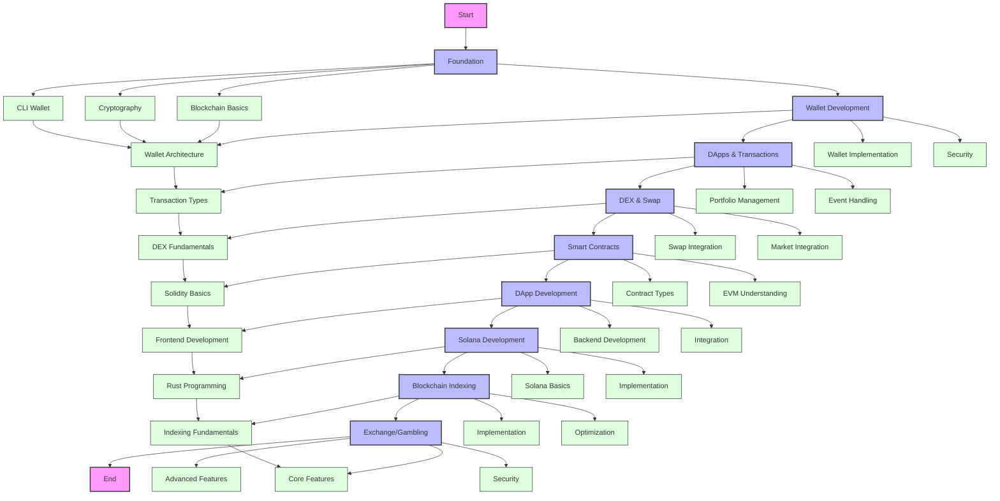

# Web3 Development Learning Path

This repository contains a comprehensive learning path for Web3 development, structured to take you from basics to advanced concepts.

## Learning Path Structure

### 1. Foundation (2 weeks)
#### Week 1: Blockchain Basics and Cryptography
- [x] **Blockchain Fundamentals**
  - Why blockchains? What do they provide?
  - Understanding decentralization
  - RPCs and Common RPC methods
  - Wei vs Ether, Lamports vs SOL
  - Cryptography basics (hashing, encryption, keccak256)
  - Gas and Transactions
  - Public/Private keys and Mnemonic Phrases
  - Token basics (ERC20, ERC721)
  - Basic cryptography
  - Message signing
  - Devnet vs Mainnet environments
  - Airdropping
  - Block explorers (Etherscan, Solscan)

#### Week 2: Practical Implementation
- [ ] **CLI Wallet Development**
  - Creating a CLI wallet
  - Generating private/public keys
  - Airdropping native tokens
  - Executing transactions via CLI
  - Exploring transactions on block explorers

### 2. Wallet Development (3-4 weeks)
#### Week 1: Wallet Architecture
- [ ] **Wallet Fundamentals**
  - Why wallets are needed
  - Wallet extension architecture
  - Private key security
  - RPC integration
  - Native vs ERC20 tokens
  - Token and NFT balance display
  - DApp interaction
  - Message vs Transaction signing
  - Derivation paths

#### Week 2-3: Wallet Implementation
- [ ] **Building a Wallet**
  - Creating a MyNearWallet clone
  - Implementing wallet impersonation
  - React app development
  - Wallet creation and management
  - Security implementation

### 3. DApps and Transactions (3-4 weeks)
#### Week 1: Transaction Understanding
- [ ] **Transaction Types**
  - Send transactions
  - Swap transactions
  - Smart contract interactions
  - Transaction parsing
  - Event handling
  - Indexed parameters

#### Week 2-3: Portfolio Management
- [ ] **Portfolio Tracker Development**
  - Wallet aggregation
  - Portfolio tracking
  - Airdrop notifications
  - Transaction history
  - Balance monitoring

### 4. DEX and Swap Functionality (1-2 weeks)
#### Week 1: DEX Fundamentals
- [ ] **DEX Understanding**
  - DEX architecture
  - Liquidity pools
  - Automated Market Makers
  - Token creation
  - Pool creation

#### Week 2: Implementation
- [ ] **Swap Integration**
  - Adding swap functionality
  - Market integration
  - Transaction parsing
  - Swap history tracking

### 5. Smart Contracts (2-3 weeks)
#### Week 1: Solidity Basics
- [ ] **Smart Contract Development**
  - Solidity syntax
  - Data models
  - Development tools (Remix, Truffle, Foundry)
  - OpenZeppelin integration
  - Bytecode and ABI understanding
  - EVM basics

#### Week 2: Contract Implementation
- [ ] **Contract Types**
  - ERC20 token contracts
  - ERC721 NFT contracts
  - Escrow contracts
  - Restricted NFT minting
  - Common contract patterns

### 6. DApp Development (2 weeks)
#### Week 1: Frontend Development
- [ ] **React Integration**
  - Web3 sign-in
  - Wallet adapters
  - DApp connection
  - Frontend development
  - NFT minting interface
  - Escrow contract interface

#### Week 2: Backend Development
- [ ] **Backend Implementation**
  - Web2 backend with verification
  - Node.js/Python integration
  - Security implementation
  - API development

### 7. Solana Development (4-5 weeks)
#### Week 1-2: Rust and Solana Basics
- [ ] **Rust Programming**
  - Rust bootcamp
  - Solana CLI
  - Token program
  - Data models
  - PDAs (Program Derived Addresses)

#### Week 3-4: Solana Implementation
- [ ] **Solana Development**
  - Web2 to Web3 use cases
  - Escrow contracts
  - Token program deep dive
  - Metadata handling
  - Common contracts

### 8. Blockchain Indexing (2 weeks)
#### Week 1: Indexing Fundamentals
- [ ] **Indexing Basics**
  - Payment processing
  - Blockchain indexing
  - Wallet sweeping
  - Gas optimization

#### Week 2: Implementation
- [ ] **Indexing Implementation**
  - Indexing solutions
  - Payment integration
  - Performance optimization

### 9. Exchange/Gambling Development (2 weeks)
#### Week 1: Core Features
- [ ] **Basic Implementation**
  - Order book creation
  - Game logic
  - Deposit/withdrawal system
  - Wallet management
  - Security implementation

#### Week 2: Advanced Features
- [ ] **Advanced Implementation**
  - Hot/cold wallet system
  - Shamir's Secret Sharing
  - Exchange features
  - Gambling features

## Learning Path Flow Diagram



## Detailed Daily Schedule

[Rest of the content remains the same...]

## Additional Resources

### Development Tools
1. **IDE and Editors**
   - [VS Code](https://code.visualstudio.com/)
   - [Remix IDE](https://remix.ethereum.org/)
   - [Truffle Suite](https://trufflesuite.com/)
   - [Hardhat](https://hardhat.org/)

2. **Testing Tools**
   - [Mocha](https://mochajs.org/)
   - [Chai](https://www.chaijs.com/)
   - [Waffle](https://getwaffle.io/)
   - [OpenZeppelin Test Helpers](https://docs.openzeppelin.com/test-helpers)

3. **Security Tools**
   - [Slither](https://github.com/crytic/slither)
   - [Mythril](https://github.com/ConsenSys/mythril)
   - [Echidna](https://github.com/crytic/echidna)
   - [Manticore](https://github.com/trailofbits/manticore)

### Learning Platforms
1. **Interactive Learning**
   - [CryptoZombies](https://cryptozombies.io/)
   - [Ethernaut](https://ethernaut.openzeppelin.com/)
   - [Capture the Ether](https://capturetheether.com/)
   - [Damn Vulnerable DeFi](https://www.damnvulnerabledefi.xyz/)

2. **Documentation**
   - [Ethereum.org](https://ethereum.org/en/developers/docs/)
   - [Solidity Docs](https://docs.soliditylang.org/)
   - [Web3.js Docs](https://web3js.readthedocs.io/)
   - [OpenZeppelin Docs](https://docs.openzeppelin.com/)

3. **Community Resources**
   - [Ethereum Stack Exchange](https://ethereum.stackexchange.com/)
   - [Reddit r/ethdev](https://www.reddit.com/r/ethdev/)
   - [Discord Communities](https://discord.gg/ethereum)
   - [Telegram Groups](https://t.me/ethdev)

### Development Services
1. **Node Providers**
   - [Infura](https://infura.io/)
   - [Alchemy](https://www.alchemy.com/)
   - [QuickNode](https://www.quicknode.com/)
   - [GetBlock](https://getblock.io/)

2. **Block Explorers**
   - [Etherscan](https://etherscan.io/)
   - [PolygonScan](https://polygonscan.com/)
   - [BscScan](https://bscscan.com/)
   - [Solscan](https://solscan.io/)

3. **Deployment Services**
   - [Vercel](https://vercel.com/)
   - [Netlify](https://www.netlify.com/)
   - [Heroku](https://www.heroku.com/)
   - [AWS](https://aws.amazon.com/)

## Resources

### Online Courses
1. [Ethereum Development Course](https://ethereum.org/en/developers/learning-tools/)
2. [Solidity Programming](https://cryptozombies.io/)
3. [Web3.js Tutorial](https://web3js.readthedocs.io/)
4. [Rust Programming](https://www.rust-lang.org/learn)
5. [Solana Development](https://docs.solana.com/developers)

### Documentation
1. [Ethereum Documentation](https://ethereum.org/en/docs/)
2. [Solidity Documentation](https://docs.soliditylang.org/)
3. [Web3.js Documentation](https://web3js.readthedocs.io/)
4. [Solana Documentation](https://docs.solana.com/)
5. [OpenZeppelin Documentation](https://docs.openzeppelin.com/)

### Tools
1. [Remix IDE](https://remix.ethereum.org/)
2. [Truffle Suite](https://trufflesuite.com/)
3. [Hardhat](https://hardhat.org/)
4. [Metamask](https://metamask.io/)
5. [Solana CLI](https://docs.solana.com/cli/install-solana-cli-tools)

### Practice Platforms
1. [Ethereum Testnet](https://ethereum.org/en/developers/docs/networks/)
2. [OpenSea Testnet](https://testnets.opensea.io/)
3. [Uniswap Interface](https://app.uniswap.org/)
4. [Solana Devnet](https://docs.solana.com/cluster/devnet)
5. [Rust Playground](https://play.rust-lang.org/)

## Getting Started

1. Clone this repository
2. Install required dependencies:
   ```bash
   npm install
   ```
3. Set up development environment:
   - Install Node.js
   - Install Rust
   - Install Solana CLI
   - Set up MetaMask
4. Follow the daily schedule
5. Complete exercises and projects
6. Join community discussions

## Contributing

Feel free to contribute to this learning path by:
1. Adding more resources
2. Improving documentation
3. Creating additional exercises
4. Fixing errors
5. Adding new topics
6. Improving code examples

## License

MIT License